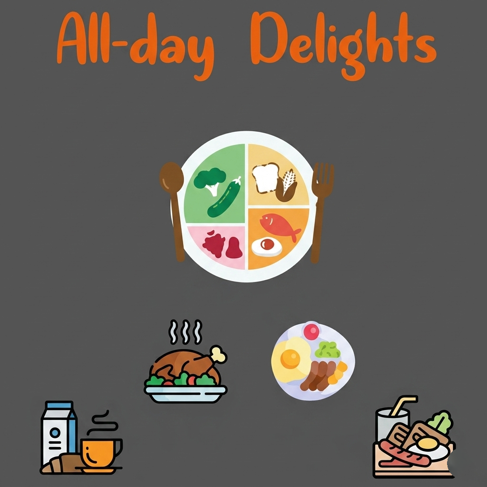
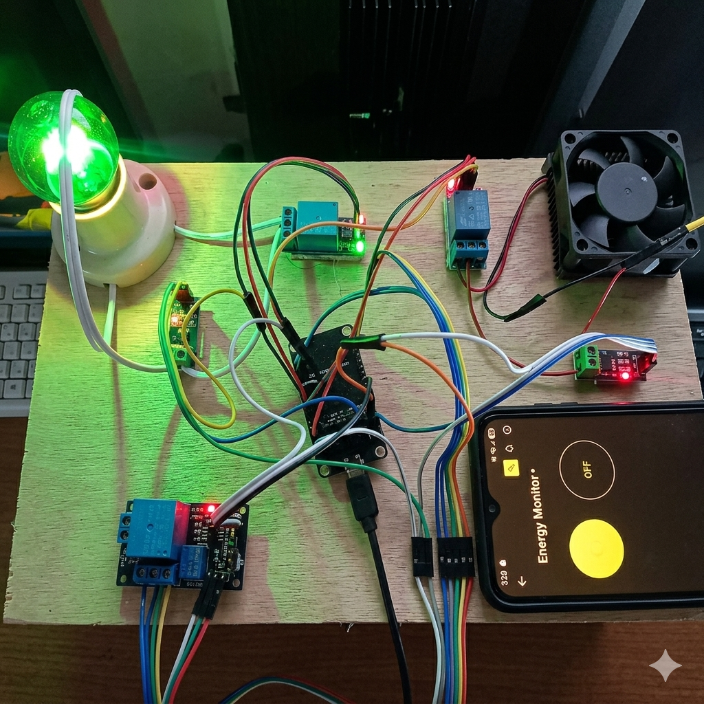

# Dimayuga_JohnIvan_PKS

> Personal Digital Portfolio — John Ivan B. Dimayuga | 4-BSIT-2


---

## 👤 About

# Personal Digital Portfolio

This is the personal digital portfolio of **Dimayuga, John Ivan B.**, a 4th-year Bachelor of Science in Information Technology student at **New Era University (NEU)**, Block **4-BSIT-2**.

## Overview

This portfolio showcases academic and technical work, including projects, technical skills, educational background, and contact information. It is designed with a modern dark-themed interface that reflects a technology-focused aesthetic.

## Technologies Used

- HTML5
- CSS3
- JavaScript

## Deployment

This project is deployed using:
- GitHub Pages / GitHub Repository Hosting
- Vercel

## Purpose

The purpose of this portfolio is to present my growth as an IT student and demonstrate my skills in software development, web technologies, and system design through real-world projects.

---

## 🌐 Live Site

🔗 [View Portfolio](https://dimayuga-john-ivan-pks-3fwq.vercel.app)

---

## 📁 Project Structure

```
Dimayuga_JohnIvan_PKS/
├── index.html                  # Main portfolio page
├── images/
│   ├── recipe-cover.png        # All-day Delights app screenshot
│   └── smart-energy-saver.png  # Smart Energy Saver hardware photo
└── README.md                   # This file
```

---

## 🚀 Featured Projects

### 🍽 PROJECT_001 — Flavor Finds
**App Name: All-day Delights**

A mobile recipe app built for Android that helps users discover and explore meals for any time of day — breakfast, lunch, dinner, and everything in between. The app features a balanced food plate guide, meal categories, and a clean food-focused UI.



- **Features:** Browse Recipes, Search & Filter, Ingredients List, Step-by-Step Cooking Guide, Meal Categories, Featured Picks
- **Tech Stack:** Kotlin, Android Studio, Android SDK, XML Layout

---

### ⚡ PROJECT_002 — Smart Energy Saver

An IoT-based smart home energy management system built with real Arduino hardware. The system monitors electricity usage, controls physical devices (light bulb, fan, relay modules) remotely through a mobile Energy Monitor app, and provides real-time feedback via sensors and actuators.



- **Hardware Components:** Arduino board, relay modules, light bulb, DC fan, current sensors, jumper wires
- **Mobile App:** Energy Monitor — controls devices ON/OFF remotely with real-time status display
- **Features:** Real-time energy monitoring, Remote device control (ON/OFF), Physical device actuation, Sensor feedback
- **Devices Controlled:** Smart Light, Cooling Fan, Relay-switched appliances
- **Tech Stack:** Arduino, IoT, C / Embedded C, Sensors & Actuators, Mobile App Integration

---

### 🖥 PROJECT_003 — Digital Portfolio

This portfolio website — designed with a dark, techy aesthetic and deployed via GitHub + Vercel.

- **Tech Stack:** HTML5, CSS3, JavaScript, Vercel

---

## 🛠 Skills & Technologies

| Category | Technologies |
|---|---|
| Languages | HTML5, CSS3, JavaScript, PHP, Python, Java, SQL, Kotlin |
| Frameworks & Libraries | React, Bootstrap, Tailwind CSS, Node.js, Laravel |
| Tools & Platforms | Git, GitHub, VS Code, MySQL, Figma, Vercel, Linux |
| Networking & IoT | IoT Systems, Arduino, Cisco Networking, Network Management, Wokwi Simulator |
| Core Concepts | OOP, REST APIs, MVC, Responsive Design, Database Design, Agile |

---

## 🎓 Education

**Bachelor of Science in Information Technology**
New Era University
2021 — Present | Block 4-BSIT-2

Specializing in software development, web technologies, cybersecurity, and information systems. Coursework covers data structures, algorithms, database management, system analysis & design, network fundamentals, network management, and foundational cybersecurity principles such as threat identification, system protection, and secure system design.

---

## 📬 Contact

- 📧 Email: [johnivan.dimayuga@neu.edu.ph](mailto:johnivan.dimayuga@neu.edu.ph)
- 💼 Open to internships, project collaborations, and opportunities

---

## 📦 Submission Info

| Field | Details |
|---|---|
| Name | Dimayuga, John Ivan B. |
| Block | 4-BSIT-2 |
| Program | BS Information Technology |
| School | New Era University |
| Zip File | `Dimayuga_JohnIvan_PKS.zip` |

---

*Built with HTML · CSS · JS · Deployed on Vercel*
